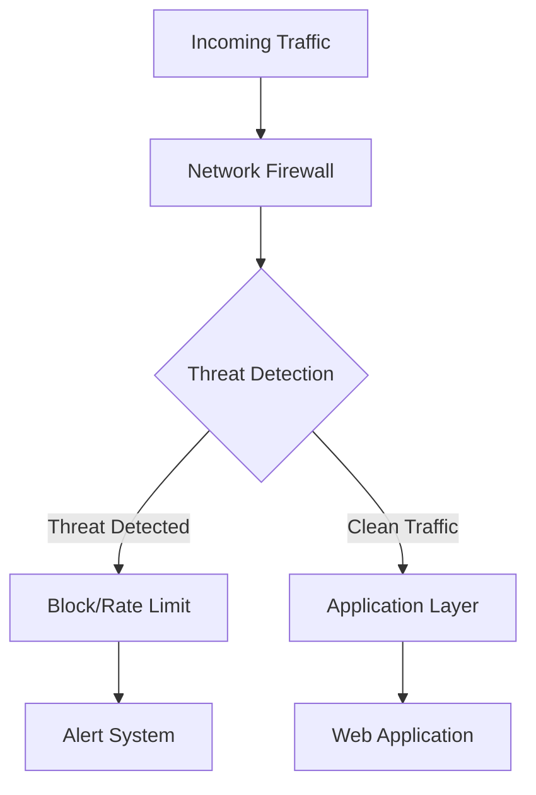
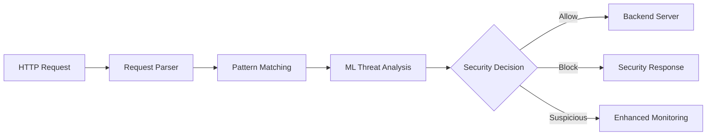
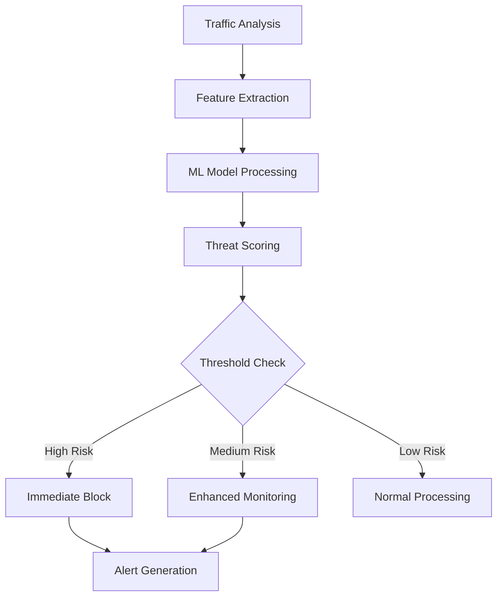
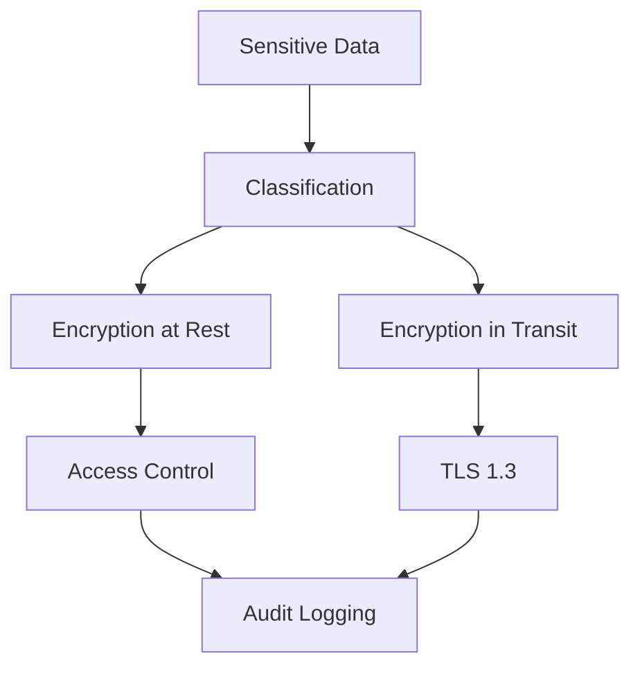

# Security Architecture

## Overview

nginx-defender implements a multi-layered security architecture designed to provide comprehensive protection against modern web threats while maintaining high performance and scalability.

## Security Layers

### 1. Network Layer Security

#### Firewall Integration


**Components:**
- Multi-backend firewall support (iptables, nftables, pfctl)
- Real-time rule management
- Geographic IP blocking
- DDoS mitigation mechanisms

**Security Controls:**
- IP-based access control
- Port-based filtering
- Protocol inspection
- Connection rate limiting

### 2. Application Layer Security

#### Web Application Firewall (WAF)


**Features:**
- SQL injection detection
- XSS protection
- CSRF prevention
- File upload security
- API security validation

**Pattern Matching:**
- Regular expression rules
- Signature-based detection
- Behavioral analysis
- Custom rule engine

### 3. Machine Learning Security

#### Threat Detection Engine


**Capabilities:**
- Real-time threat scoring
- Anomaly detection
- Behavioral analysis
- Adaptive learning
- Model validation and updates

**Security Algorithms:**
- Random Forest for classification
- Isolation Forest for anomaly detection
- Neural networks for pattern recognition
- Ensemble methods for accuracy

### 4. Data Security Layer

#### Information Protection


**Data Classification:**
- Public data
- Internal data
- Confidential data
- Restricted data

**Protection Mechanisms:**
- AES-256 encryption
- Key management system
- Data loss prevention (DLP)
- PII detection and redaction

## Security Components

### Authentication and Authorization

#### Multi-Factor Authentication
```go
type AuthenticationService struct {
    primaryAuth   PrimaryAuthenticator
    secondaryAuth SecondaryAuthenticator
    sessionMgr    SessionManager
    auditLogger   AuditLogger
}

func (a *AuthenticationService) Authenticate(credentials *Credentials) (*Session, error) {
    // Primary authentication (username/password)
    user, err := a.primaryAuth.Validate(credentials)
    if err != nil {
        a.auditLogger.LogFailedAttempt(credentials.Username, "primary_auth_failed")
        return nil, err
    }
    
    // Secondary authentication (MFA)
    if user.RequiresMFA() {
        err = a.secondaryAuth.Validate(user, credentials.MFAToken)
        if err != nil {
            a.auditLogger.LogFailedAttempt(user.Username, "mfa_failed")
            return nil, err
        }
    }
    
    // Create secure session
    session := a.sessionMgr.CreateSession(user)
    a.auditLogger.LogSuccessfulLogin(user.Username, session.ID)
    
    return session, nil
}
```

#### Role-Based Access Control (RBAC)
```go
type Permission string

const (
    PermissionViewDashboard   Permission = "dashboard:view"
    PermissionManageRules     Permission = "rules:manage"
    PermissionViewLogs        Permission = "logs:view"
    PermissionManageUsers     Permission = "users:manage"
    PermissionSystemAdmin     Permission = "system:admin"
)

type Role struct {
    Name        string       `json:"name"`
    Permissions []Permission `json:"permissions"`
    Description string       `json:"description"`
}

func (r *Role) HasPermission(perm Permission) bool {
    for _, p := range r.Permissions {
        if p == perm || p == PermissionSystemAdmin {
            return true
        }
    }
    return false
}
```

### Secure Communication

#### TLS Configuration
```yaml
tls:
  min_version: "1.3"
  max_version: "1.3"
  cipher_suites:
    - "TLS_AES_256_GCM_SHA384"
    - "TLS_CHACHA20_POLY1305_SHA256"
    - "TLS_AES_128_GCM_SHA256"
  curves:
    - "X25519"
    - "P-384"
    - "P-256"
  cert_file: "/etc/ssl/certs/nginx-defender.crt"
  key_file: "/etc/ssl/private/nginx-defender.key"
  ca_file: "/etc/ssl/certs/ca-bundle.crt"
  verify_client: true
  session_timeout: "5m"
```

#### Certificate Management
```go
type CertificateManager struct {
    certStore    CertificateStore
    validator    CertificateValidator
    rotationMgr  CertificateRotationManager
    alertManager AlertManager
}

func (cm *CertificateManager) ValidateCertificate(cert *x509.Certificate) error {
    // Check expiration
    if time.Now().After(cert.NotAfter) {
        return fmt.Errorf("certificate expired at %v", cert.NotAfter)
    }
    
    // Check not valid yet
    if time.Now().Before(cert.NotBefore) {
        return fmt.Errorf("certificate not valid until %v", cert.NotBefore)
    }
    
    // Check certificate chain
    if err := cm.validator.ValidateChain(cert); err != nil {
        return fmt.Errorf("certificate chain validation failed: %w", err)
    }
    
    // Check revocation status
    if err := cm.validator.CheckRevocation(cert); err != nil {
        return fmt.Errorf("certificate revocation check failed: %w", err)
    }
    
    // Alert if expiring soon
    if time.Now().Add(30 * 24 * time.Hour).After(cert.NotAfter) {
        cm.alertManager.SendAlert("certificate_expiring_soon", map[string]interface{}{
            "subject": cert.Subject.String(),
            "expiry":  cert.NotAfter,
        })
    }
    
    return nil
}
```

### Input Validation and Sanitization

#### Request Validation
```go
type RequestValidator struct {
    patterns    *PatternMatcher
    sanitizer   *InputSanitizer
    rateLimit   *RateLimiter
    geoBlocker  *GeoBlocker
}

func (rv *RequestValidator) ValidateRequest(req *http.Request) (*ValidationResult, error) {
    result := &ValidationResult{
        Allowed:    true,
        Confidence: 1.0,
        Reasons:    []string{},
    }
    
    // Geographic validation
    if blocked, reason := rv.geoBlocker.IsBlocked(req.RemoteAddr); blocked {
        result.Allowed = false
        result.Reasons = append(result.Reasons, reason)
        return result, nil
    }
    
    // Rate limiting
    if exceeded, limit := rv.rateLimit.CheckLimit(req.RemoteAddr); exceeded {
        result.Allowed = false
        result.Reasons = append(result.Reasons, fmt.Sprintf("rate limit exceeded: %v", limit))
        return result, nil
    }
    
    // Pattern matching
    if threat, confidence := rv.patterns.AnalyzeRequest(req); threat {
        result.Allowed = false
        result.Confidence = confidence
        result.Reasons = append(result.Reasons, "malicious pattern detected")
        return result, nil
    }
    
    // Input sanitization
    sanitized, modified := rv.sanitizer.SanitizeRequest(req)
    if modified {
        result.Modified = true
        result.SanitizedRequest = sanitized
    }
    
    return result, nil
}
```

### Audit Logging and Monitoring

#### Security Event Logging
```go
type SecurityEvent struct {
    Timestamp   time.Time              `json:"timestamp"`
    EventType   string                 `json:"event_type"`
    Severity    string                 `json:"severity"`
    Source      string                 `json:"source"`
    Target      string                 `json:"target"`
    Action      string                 `json:"action"`
    Result      string                 `json:"result"`
    Details     map[string]interface{} `json:"details"`
    UserAgent   string                 `json:"user_agent,omitempty"`
    RequestID   string                 `json:"request_id,omitempty"`
    SessionID   string                 `json:"session_id,omitempty"`
}

type AuditLogger struct {
    writer      io.Writer
    encoder     *json.Encoder
    buffer      chan SecurityEvent
    asyncWriter bool
}

func (al *AuditLogger) LogSecurityEvent(event SecurityEvent) {
    event.Timestamp = time.Now().UTC()
    
    if al.asyncWriter {
        select {
        case al.buffer <- event:
            // Event queued successfully
        default:
            // Buffer full, log synchronously to prevent loss
            al.writeEvent(event)
        }
    } else {
        al.writeEvent(event)
    }
}

func (al *AuditLogger) writeEvent(event SecurityEvent) {
    if err := al.encoder.Encode(event); err != nil {
        log.Printf("Failed to write audit event: %v", err)
    }
}
```

### Threat Intelligence Integration

#### External Threat Feeds
```go
type ThreatIntelligence struct {
    feeds      []ThreatFeed
    cache      ThreatCache
    updater    FeedUpdater
    validator  FeedValidator
}

type ThreatIndicator struct {
    Type        string    `json:"type"`        // ip, domain, hash, etc.
    Value       string    `json:"value"`       // actual indicator value
    Confidence  float64   `json:"confidence"`  // 0.0 - 1.0
    Severity    string    `json:"severity"`    // low, medium, high, critical
    Source      string    `json:"source"`      // feed source
    FirstSeen   time.Time `json:"first_seen"`
    LastSeen    time.Time `json:"last_seen"`
    Tags        []string  `json:"tags"`
    Description string    `json:"description"`
}

func (ti *ThreatIntelligence) CheckThreat(indicator string, indicatorType string) (*ThreatIndicator, bool) {
    // Check local cache first
    if threat, found := ti.cache.Get(indicator); found {
        return threat, true
    }
    
    // Query threat feeds
    for _, feed := range ti.feeds {
        if threat, found := feed.Query(indicator, indicatorType); found {
            // Validate and cache result
            if ti.validator.Validate(threat) {
                ti.cache.Set(indicator, threat)
                return threat, true
            }
        }
    }
    
    return nil, false
}
```

## Security Deployment Patterns

### High Availability Security

#### Multi-Node Deployment
```yaml
apiVersion: apps/v1
kind: Deployment
metadata:
  name: nginx-defender
spec:
  replicas: 3
  strategy:
    type: RollingUpdate
    rollingUpdate:
      maxUnavailable: 1
      maxSurge: 1
  template:
    spec:
      securityContext:
        runAsNonRoot: true
        runAsUser: 65534
        fsGroup: 65534
      containers:
      - name: nginx-defender
        image: nginx-defender:latest
        securityContext:
          allowPrivilegeEscalation: false
          readOnlyRootFilesystem: true
          capabilities:
            drop:
            - ALL
            add:
            - NET_ADMIN
        resources:
          limits:
            memory: "1Gi"
            cpu: "500m"
          requests:
            memory: "512Mi"
            cpu: "250m"
```

### Zero-Trust Architecture

#### Service Mesh Integration
```yaml
apiVersion: security.istio.io/v1beta1
kind: AuthorizationPolicy
metadata:
  name: nginx-defender-authz
spec:
  selector:
    matchLabels:
      app: nginx-defender
  rules:
  - from:
    - source:
        principals: ["cluster.local/ns/monitoring/sa/prometheus"]
    to:
    - operation:
        methods: ["GET"]
        paths: ["/metrics"]
  - from:
    - source:
        principals: ["cluster.local/ns/nginx-defender/sa/dashboard"]
    to:
    - operation:
        methods: ["GET", "POST"]
        paths: ["/api/*"]
```

## Performance and Security Trade-offs

### Optimization Strategies

1. **Caching Security Decisions**
   - LRU cache for firewall rules
   - Bloom filters for known threats
   - Result caching with TTL

2. **Asynchronous Processing**
   - Non-blocking threat analysis
   - Background model updates
   - Async audit logging

3. **Resource Management**
   - Connection pooling
   - Memory-efficient data structures
   - CPU-bound vs IO-bound optimization

### Security Metrics

```prometheus
# Threat detection rate
nginx_defender_threats_detected_total{type="malware"} 157
nginx_defender_threats_detected_total{type="sql_injection"} 23
nginx_defender_threats_detected_total{type="xss"} 89

# Response times
nginx_defender_request_duration_seconds{method="POST",status="200"} 0.045
nginx_defender_ml_analysis_duration_seconds{model="threat_detection"} 0.012

# Security effectiveness
nginx_defender_blocked_requests_total{reason="rate_limit"} 1234
nginx_defender_false_positive_rate{threshold="0.8"} 0.02
```

This security architecture provides comprehensive protection while maintaining high performance and scalability for enterprise deployments.
