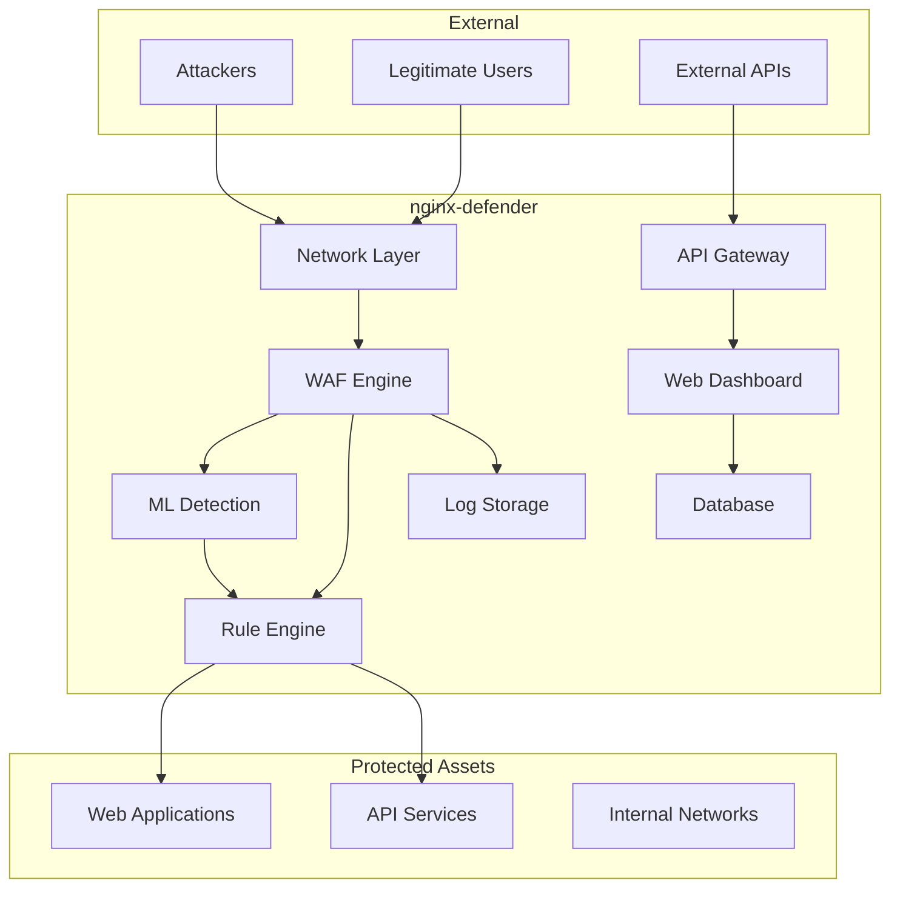
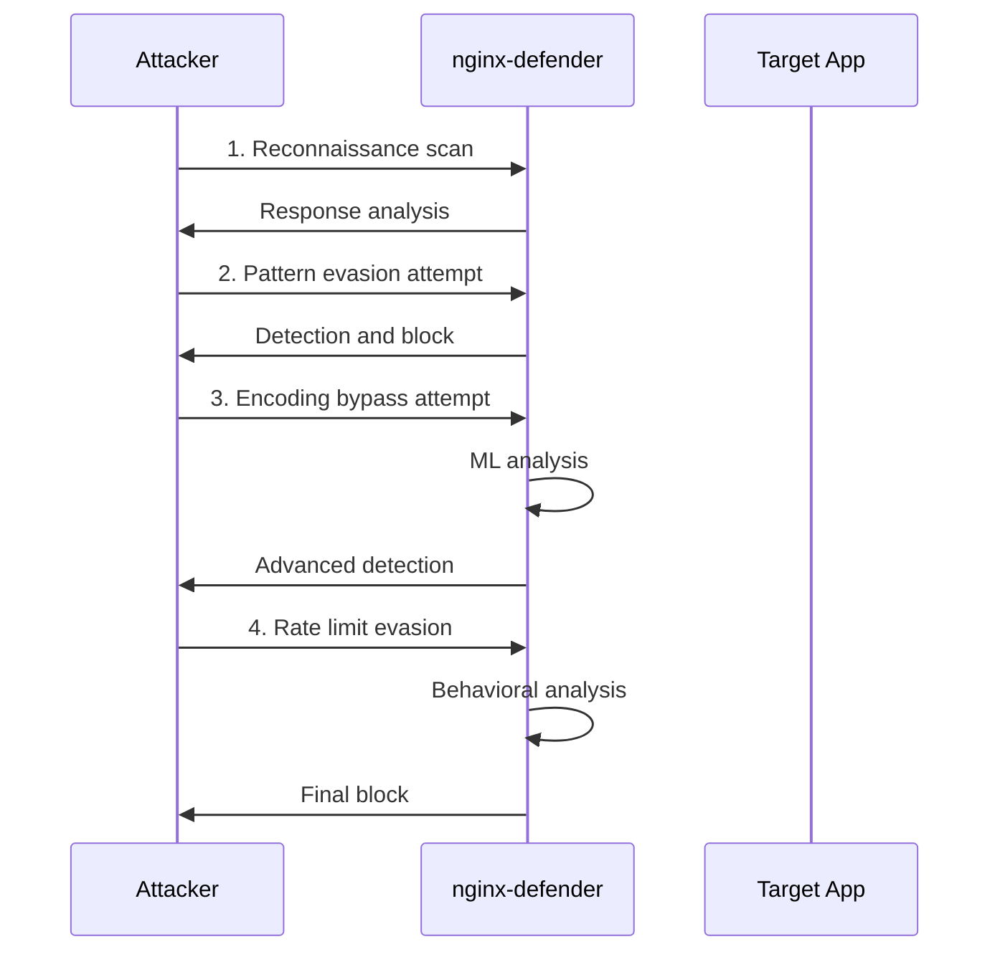
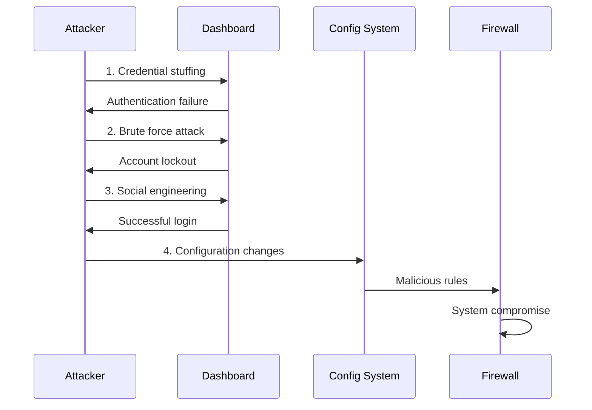
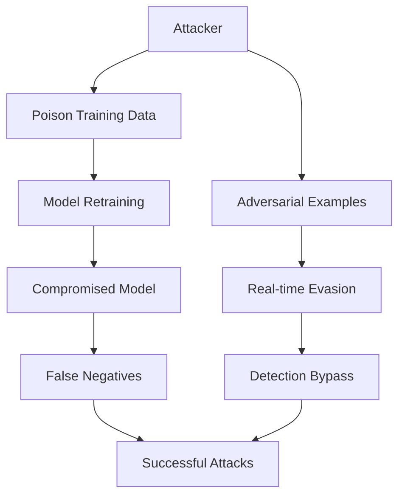
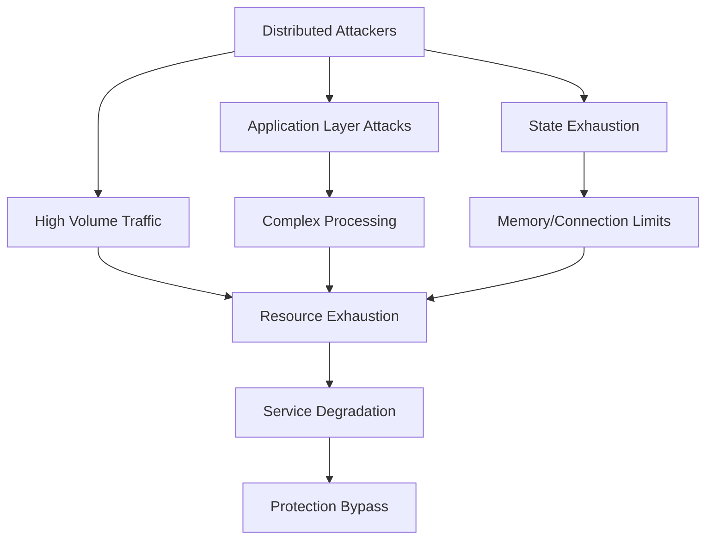

# Threat Model for nginx-defender

## Executive Summary

This document provides a comprehensive threat model for nginx-defender, an enterprise-grade Web Application Firewall (WAF) and network security solution. The threat model identifies potential security risks, attack vectors, and mitigation strategies to ensure robust protection against modern cybersecurity threats.

## System Overview

### Architecture Components



### Trust Boundaries

1. **External Network ↔ nginx-defender**: Primary security boundary
2. **nginx-defender ↔ Protected Applications**: Internal trust boundary
3. **Admin Interface ↔ Configuration System**: Administrative boundary
4. **Log System ↔ External Monitoring**: Data export boundary

## Assets Identification

### Primary Assets

| Asset | Classification | Impact | Description |
|-------|---------------|---------|-------------|
| Protected Web Applications | Critical | High | Primary assets being protected |
| Security Rules Database | Critical | High | Firewall and WAF rules |
| ML Models | Critical | Medium | Threat detection algorithms |
| Configuration Data | Confidential | Medium | System configuration and settings |
| Log Data | Internal | Medium | Security events and audit trails |
| API Keys | Restricted | High | Authentication credentials |

### Supporting Assets

| Asset | Classification | Impact | Description |
|-------|---------------|---------|-------------|
| Admin Dashboard | Internal | Medium | Management interface |
| Metrics Data | Internal | Low | Performance and security metrics |
| Documentation | Public | Low | System documentation |
| Container Images | Internal | Medium | Application deployment artifacts |

## Threat Actors

### External Threat Actors

1. **Cybercriminals**
   - **Motivation**: Financial gain, data theft
   - **Capabilities**: High technical skills, automated tools
   - **Likelihood**: High
   - **Attack Vectors**: Web application exploits, DDoS attacks

2. **Nation-State Actors**
   - **Motivation**: Espionage, disruption
   - **Capabilities**: Advanced persistent threats (APT)
   - **Likelihood**: Medium
   - **Attack Vectors**: Zero-day exploits, supply chain attacks

3. **Hacktivists**
   - **Motivation**: Ideological, protest
   - **Capabilities**: Medium technical skills, coordination
   - **Likelihood**: Medium
   - **Attack Vectors**: DDoS, defacement, information leaks

4. **Script Kiddies**
   - **Motivation**: Recognition, experimentation
   - **Capabilities**: Low to medium skills, existing tools
   - **Likelihood**: High
   - **Attack Vectors**: Automated scanning, known exploits

### Internal Threat Actors

1. **Malicious Insiders**
   - **Motivation**: Financial gain, revenge
   - **Capabilities**: Legitimate access, system knowledge
   - **Likelihood**: Low
   - **Attack Vectors**: Privilege abuse, data exfiltration

2. **Compromised Insiders**
   - **Motivation**: Coercion, social engineering
   - **Capabilities**: Legitimate access
   - **Likelihood**: Medium
   - **Attack Vectors**: Credential theft, insider trading

## Attack Scenarios

### Scenario 1: WAF Bypass Attack

**Objective**: Bypass nginx-defender to attack protected applications



**Attack Steps**:
1. Reconnaissance and fingerprinting
2. Pattern analysis and evasion techniques
3. Encoding and obfuscation attempts
4. Rate limiting bypass strategies
5. ML model adversarial attacks

**Potential Impact**: 
- Unauthorized access to protected applications
- Data breach or service disruption
- Compromise of backend systems

**Mitigation Strategies**:
- Multi-layered detection (signatures + ML + behavioral)
- Regular pattern updates and model retraining
- Anomaly detection for unknown attack patterns
- Rate limiting with multiple algorithms
- Input validation and sanitization

### Scenario 2: Admin Interface Compromise

**Objective**: Gain administrative control of nginx-defender



**Attack Steps**:
1. Credential harvesting and stuffing
2. Brute force authentication attacks
3. Social engineering for credentials
4. Session hijacking or token theft
5. Privilege escalation attempts

**Potential Impact**:
- Complete system compromise
- Disabling of security protections
- Access to sensitive configuration data
- Manipulation of security rules

**Mitigation Strategies**:
- Multi-factor authentication (MFA)
- Strong password policies
- Account lockout mechanisms
- Session management and timeout
- Role-based access control (RBAC)
- Admin action audit logging

### Scenario 3: ML Model Poisoning

**Objective**: Compromise machine learning threat detection



**Attack Steps**:
1. Data poisoning during training
2. Adversarial example generation
3. Model inversion attacks
4. Feature manipulation
5. Feedback loop exploitation

**Potential Impact**:
- Reduced threat detection accuracy
- Increased false positive/negative rates
- Complete model compromise
- Undetected malicious activities

**Mitigation Strategies**:
- Data validation and sanitization
- Model validation and testing
- Adversarial training techniques
- Ensemble model approaches
- Continuous model monitoring

### Scenario 4: Denial of Service (DoS)

**Objective**: Overwhelm nginx-defender to cause service disruption



**Attack Steps**:
1. Volumetric attacks (flooding)
2. Resource exhaustion attacks
3. Application-layer DoS
4. State exhaustion attacks
5. Amplification attacks

**Potential Impact**:
- Service unavailability
- Performance degradation
- Resource exhaustion
- Secondary attack opportunities

**Mitigation Strategies**:
- Rate limiting and traffic shaping
- Resource monitoring and alerting
- Distributed deployment architecture
- Auto-scaling capabilities
- Traffic analysis and filtering

## Risk Assessment Matrix

| Threat | Likelihood | Impact | Risk Level | Priority |
|--------|------------|---------|------------|----------|
| WAF Bypass | High | High | Critical | P1 |
| Admin Compromise | Medium | High | High | P2 |
| DoS Attack | High | Medium | High | P2 |
| ML Poisoning | Low | High | Medium | P3 |
| Data Exfiltration | Medium | Medium | Medium | P3 |
| Configuration Tampering | Low | Medium | Low | P4 |

## Security Controls

### Preventive Controls

1. **Authentication and Authorization**
   ```yaml
   security:
     authentication:
       multi_factor: true
       password_policy:
         min_length: 12
         complexity: high
         rotation: 90d
     authorization:
       rbac: true
       principle_of_least_privilege: true
   ```

2. **Input Validation**
   ```go
   type InputValidator struct {
       patterns    []Pattern
       sanitizers  []Sanitizer
       validators  []Validator
   }
   
   func (iv *InputValidator) ValidateInput(input string) (*ValidationResult, error) {
       // Multi-layer validation
       for _, validator := range iv.validators {
           if result := validator.Validate(input); !result.Valid {
               return result, nil
           }
       }
       return &ValidationResult{Valid: true}, nil
   }
   ```

3. **Encryption**
   ```yaml
   encryption:
     at_rest:
       algorithm: "AES-256-GCM"
       key_management: "HSM"
     in_transit:
       tls_version: "1.3"
       cipher_suites: ["TLS_AES_256_GCM_SHA384"]
   ```

### Detective Controls

1. **Anomaly Detection**
   ```go
   type AnomalyDetector struct {
       baselines   map[string]Baseline
       thresholds  map[string]float64
       models      []MLModel
   }
   
   func (ad *AnomalyDetector) DetectAnomaly(metrics *Metrics) *AnomalyResult {
       score := ad.calculateAnomalyScore(metrics)
       if score > ad.thresholds["critical"] {
           return &AnomalyResult{
               Detected: true,
               Severity: "critical",
               Score:    score,
           }
       }
       return &AnomalyResult{Detected: false}
   }
   ```

2. **Security Monitoring**
   ```prometheus
   # Security metrics for monitoring
   nginx_defender_failed_auth_attempts_total
   nginx_defender_blocked_requests_total
   nginx_defender_anomaly_score
   nginx_defender_ml_model_accuracy
   ```

### Responsive Controls

1. **Incident Response**
   ```go
   type IncidentResponse struct {
       alertManager    AlertManager
       containment     ContainmentService
       forensics       ForensicsService
       recovery        RecoveryService
   }
   
   func (ir *IncidentResponse) HandleIncident(incident *SecurityIncident) error {
       // Immediate containment
       if err := ir.containment.Contain(incident); err != nil {
           return err
       }
       
       // Evidence collection
       go ir.forensics.CollectEvidence(incident)
       
       // Alert stakeholders
       ir.alertManager.SendAlert(incident)
       
       return nil
   }
   ```

2. **Automated Response**
   ```yaml
   automated_response:
     triggers:
       - event: "brute_force_detected"
         action: "temporary_ip_block"
         duration: "1h"
       - event: "malware_detected"
         action: "immediate_block"
         duration: "24h"
   ```

## Recommendations

### Immediate Actions (0-30 days)

1. **Implement Multi-Factor Authentication**
   - Deploy MFA for all administrative accounts
   - Integrate with existing identity providers
   - Enforce MFA for sensitive operations

2. **Enhance Logging and Monitoring**
   - Implement comprehensive audit logging
   - Set up real-time security monitoring
   - Configure automated alerting

3. **Update Security Configurations**
   - Review and harden default configurations
   - Implement security best practices
   - Update TLS configurations

### Medium-term Actions (1-6 months)

1. **Advanced Threat Detection**
   - Deploy behavioral analysis capabilities
   - Implement threat intelligence integration
   - Enhance ML model robustness

2. **Security Testing**
   - Conduct penetration testing
   - Implement automated security scanning
   - Perform threat modeling updates

3. **Incident Response Preparation**
   - Develop incident response procedures
   - Train security team members
   - Conduct tabletop exercises

### Long-term Actions (6+ months)

1. **Zero-Trust Architecture**
   - Implement service mesh security
   - Deploy micro-segmentation
   - Enhance identity verification

2. **Advanced Analytics**
   - Implement security analytics platform
   - Deploy UEBA capabilities
   - Enhance threat hunting

3. **Compliance and Governance**
   - Achieve security certifications
   - Implement security governance framework
   - Regular security assessments

## Conclusion

This threat model provides a comprehensive analysis of security risks for nginx-defender and outlines specific mitigation strategies. Regular updates to this document are essential as the threat landscape evolves and new attack techniques emerge.

The identified threats should be continuously monitored, and the security controls should be tested and updated regularly to maintain effective protection against evolving cyber threats.

---

**Document Version**: 1.0  
**Last Updated**: December 2024  
**Next Review**: March 2025  
**Owner**: Security Architecture Team
